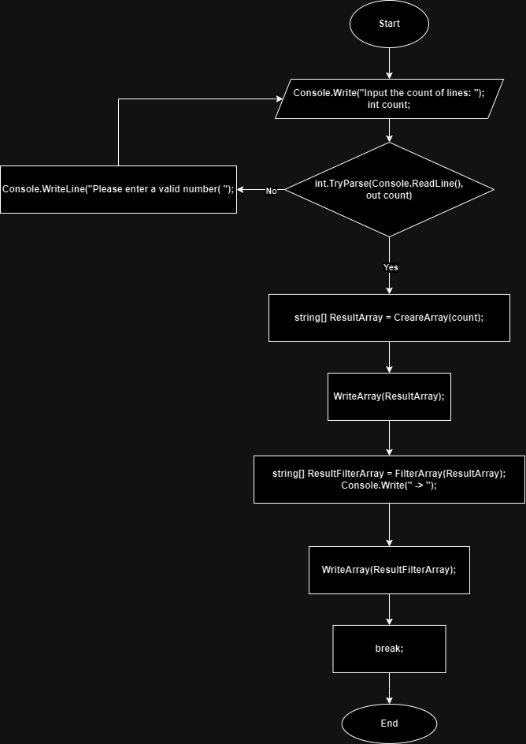

# final_exam
1. Создать репозиторий на GitHub
2. Нарисовать блок-схему алгоритма (можно обойтись блок-схемой основной содержательной части, если вы выделяете её в отдельный метод)
3. Снабдить репозиторий оформленным текстовым описанием решения (файл README.md)
4. Написать программу, решающую поставленную задачу
5. Использовать контроль версий в работе над этим небольшим проектом (не должно быть так, что всё залито одним коммитом, как минимум этапы 2, 3, и 4 должны быть расположены в разных коммитах)

**Задача**: Написать программу, которая из имеющегося массива строк формирует новый массив из строк, длина которых меньше, либо равна 3 символам. Первоначальный массив можно ввести с клавиатуры, либо задать на старте выполнения алгоритма.   При решении не рекомендуется пользоваться коллекциями, лучше обойтись исключительно массивами.

Примеры:
[“Hello”, “2”, “world”, “:-)”] → [“2”, “:-)”]   
[“1234”, “1567”, “-2”, “computer science”] → [“-2”]        
[“Russia”, “Denmark”, “Kazan”] → []

# Решения
1. Созданно :D
2. Блок-схема:  

3. Done :)
4. Done :
```
string[] CreareArray(int count)
{
    string[] UserArray = new string[count];
    for (int i = 0; i < count; i++)
    {
        Console.Write($"Input line {i + 1}: ");
        UserArray[i] = Console.ReadLine();
    }
    return UserArray;
}

void WriteArray(string[] array)
{ 
    Console.Write("[ ");
    for (int i = 0; i < array.Length; i++)
    {
        Console.Write($"\"{array[i]}\"");
        if (i < array.Length - 1)
        {
            Console.Write(", ");
        }
    }
    Console.Write(" ]");
    
    // ну или так :D
    // string result = "[ " + string.Join(", ", array.Select(s => $"\"{s}\"")) + " ]";
    // Console.Write(result);
    
}

string[] FilterArray(string[] Array)
{
    string[] doneArray = new string[Array.Length];

    int count = 0;
    for (int i = 0; i < Array.Length; i++)
    {
        string str = Array[i];

        if (str.Length <= 3)
        {
            doneArray[count] = str;
            count++;
        }
    }
    string[] finalArray = new string[count]; // удаление пустых строк [как вы и просили, массивом все :( ]
    for (int i = 0; i < count; i++)
    {
        finalArray[i] = doneArray[i];
    }
    return finalArray;
}

Console.Write("Input the count of lines: ");
while (true)
{
    int count;

    if (int.TryParse(Console.ReadLine(), out count))
    {
        string[] ResultArray = CreareArray(count);
        Console.WriteLine();
        WriteArray(ResultArray);

        string[] ResultFilterArray = FilterArray(ResultArray);
        Console.Write(" -> ");
        WriteArray(ResultFilterArray);
        break;
    }
    else
    {
        Console.WriteLine("Please enter a valid number( ");
        Console.WriteLine();
    }
}
```
5. Done :D